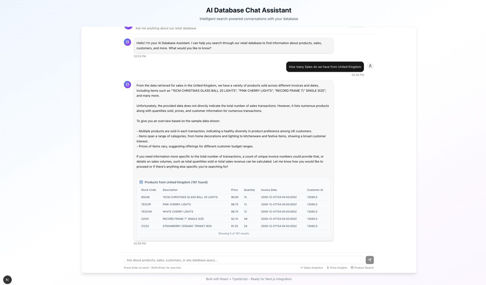

# AI Database Chat Assistant




This project is an intelligent chat interface for exploring and analyzing retail sales data using advanced search and AI-powered tool calling. Built with React, TypeScript, Next.js, and Prisma, it leverages [Orama](https://orama.com/) for fast search indexing and OpenAI's GPT for natural language understanding and tool selection.

## Features

- **Conversational Search:** Ask questions about products, sales, customers, and more in natural language.
- **Semantic & Filtered Search:** Uses Orama for both keyword and semantic (vector) search, enabling fast and relevant results.
- **Tool Calling:** The AI automatically selects the best tool for your query—whether it's searching products, analyzing sales, or summarizing statistics.
- **Interactive Results:** View results as tables, lists, charts, or text summaries directly in the chat.

## How It Works

- **Orama Indexing:** Retail records are indexed with Orama for instant search and semantic queries.
- **Tool Calling:** OpenAI's GPT chooses from a set of tools (like `search_products`, `get_top_selling_products`, or `vector_search`) to answer your questions.
- **Database Integration:** Uses Prisma ORM to manage and query the PostgreSQL database.

### Example: Orama Search & Tool Calling

```typescript
// Indexing a retail record with Orama
await orama.insert({
  invoice: row.Invoice,
  stockCode: row.StockCode,
  description: row.Description,
  quantity: Number(row.Quantity),
  invoiceDate: new Date(row.InvoiceDate).toISOString(),
  price: Number(row.Price),
  customerId: row['Customer ID'],
  country: row.Country,
});

// Tool calling in the API route
const toolResults = await toolExecutor.executeTool({
  name: 'search_products',
  parameters: { country: 'United Kingdom' },
  id: 'tool-call-1'
});
```

## Data Source

Retail data is from [Online Retail II UCI](https://www.kaggle.com/datasets/mashlyn/online-retail-ii-uci), produced under the [CC0: Public Domain license](https://creativecommons.org/publicdomain/zero/1.0/).

---

**Created by James Muchiri** -
**AI Engineer** 
___
